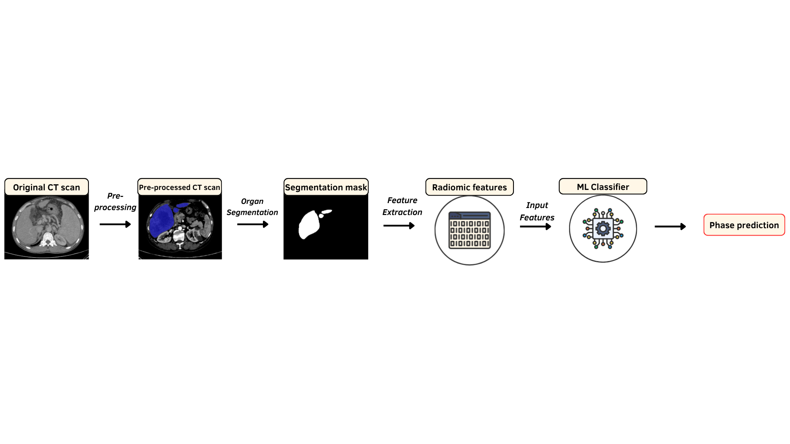

# CT Phase Classification Pipeline

This project provides a pipeline for automatic CT contrast phase classification using organ segmentation, radiomics feature extraction, and a trained machine learning model.



The pipeline takes a CT scan as input, segments selected anatomical structures using TotalSegmentator, extracts radiomic features from the segmented regions, and uses a trained XGBoost classifier to predict the CT phase.

---

## Predicted CT Phases

The model classifies scans into the four main CT contrast phases:

- **NP**: Non-Contrast Phase
- **AP**: Arterial Phase
- **VP**: Portal-Venous Phase
- **DP**: Delayed Phase

---

## Pipeline Overview

The pipeline consists of the following steps:

1. Read a CT image from a DICOM folder or a NIfTI file.
2. Clip CT intensity values to the range `[-200, 200]`.
3. Segment selected anatomical structures using TotalSegmentator.
4. Extract radiomic features from each segmentation mask using PyRadiomics.
5. Calculate selected organ-level and organ-difference features.
6. Predict the CT contrast phase using the trained XGBoost model.

The following anatomical structures are used for feature extraction:

- Aorta
- Portal vein and splenic vein
- Urinary bladder
- Kidneys, using both left and right kidney masks
- Spleen
- Liver

---

## Project Files

- `simple_phase_pipeline.py`  
  Runs the full prediction pipeline for one CT scan.

- `feature_extractor.py`  
  Reads the CT image, runs segmentation, extracts radiomic features, and prepares the final feature table.

- `run_totalsegmentator.py`  
  Runs TotalSegmentator for the selected anatomical structures.

- `final_model.pkl`  
  Trained XGBoost model used for CT phase classification.

- `features.pkl`  
  List of selected features expected by the trained model.

- `label_encoder.pkl`  
  Label encoder used to convert between numeric model outputs and CT phase labels.

- `requirements.txt`  
  Python packages needed to run the project.

---

## Requirements

This project requires **Python 3.10 or 3.11**.

Install the required packages using:

```bash
pip install -r requirements.txt
```

The main packages used in this project are:

- TotalSegmentator
- PyRadiomics
- SimpleITK
- pandas
- scikit-learn
- XGBoost
- joblib

---

## How to Run

Run the pipeline from the command line:

```bash
python simple_phase_pipeline.py "input_path"
```

The `input_path` can be either:

- a DICOM folder
- a NIfTI file, for example `.nii.gz`

Example with a NIfTI file:

```bash
python simple_phase_pipeline.py "path/to/ct_scan.nii.gz"
```

Example with a DICOM folder:

```bash
python simple_phase_pipeline.py "path/to/dicom_folder"
```

---

## Optional Arguments

Use the fast TotalSegmentator option:

```bash
python simple_phase_pipeline.py "input_path" --fast
```

Use a local TotalSegmentator model directory:

```bash
python simple_phase_pipeline.py "input_path" --totalseg-model-dir "path/to/totalseg_models"
```

Save the extracted model features to a CSV file:

```bash
python simple_phase_pipeline.py "input_path" --save-features extracted_features.csv
```

---

## Output

The pipeline prints:

- the predicted CT phase
- class probabilities, if available
- a feature check showing the number of expected and extracted features

If `--save-features` is used, the model input features are also saved as a CSV file.

---

## References

- TotalSegmentator: https://github.com/wasserth/TotalSegmentator
- PyRadiomics: https://pyradiomics.readthedocs.io/
- Wasserthal et al., *TotalSegmentator: Robust segmentation of 104 anatomical structures in CT images*, Radiology: AI (2023)
